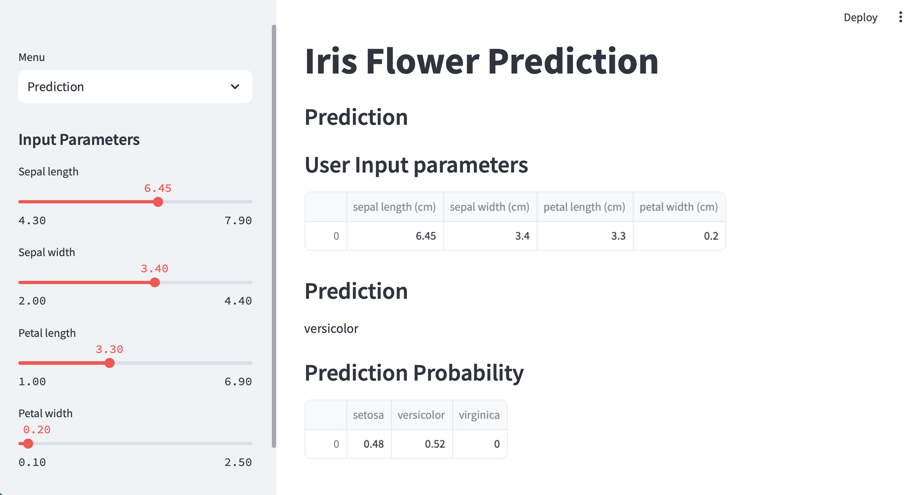

# Iris Flower Prediction Streamlit App

This is an interactive Streamlit application designed to predict the species of an Iris flower based on user-provided measurements of its sepal and petal dimensions. The app utilizes a machine learning model trained on the classic Iris dataset to perform accurate species classification.

## Installation

1. Clone this repository
```bash
git clone https://github.com/kachiann/Iris_streamlit.git
```
2. Go to folder
```bash
cd Iris_streamlit
```
3. Install the required packages:
``` bash
pip install -r requirements.txt
```

## Usage

Run the Streamlit app:
```bash
streamlit run app.py
```

The app will open in your default web browser.

Add a minor update
